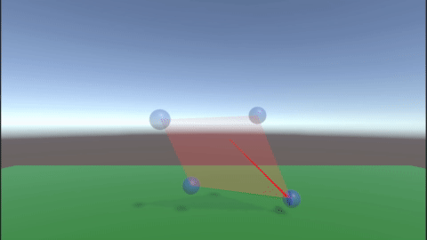
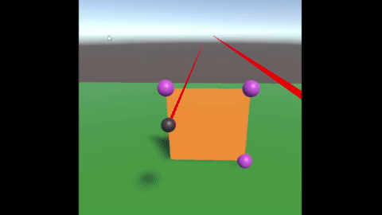
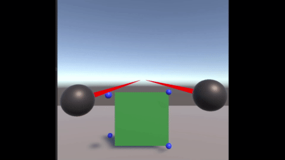

# Tracer Bullet

## Third Tracer Bullet

Capabilities:
- Implemented Implicit Euler Integration
- Refactored project structure to make swapping out parts easier
- Introduced separate packages, and unit tests

## Second tracer-bullet

Capabilities:
- Handles update both anchor points and non anchor points
- Uses new Unity Input System to read controller positions and button presses

## First tracer-bullet

Capabilities: 
- 3D mass-spring simulation
- View in VR
- VR button control interaction
- VR button to toggle simulation playback
