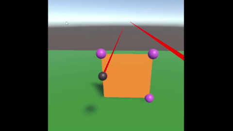

# Tracer Bullet

## Gif of second tracer-bullet

Capabilities:
- Handles update both anchor points and non anchor points
- Uses new Unity Input System to read controller positions and button presses

## Gif of first tracer-bullet

Capabilities: 
- 3D mass-spring simulation
- View in VR
- VR button control interaction
- VR button to toggle simulation playback
