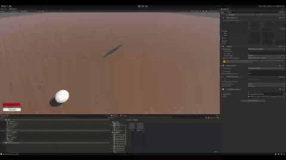

# Mass-Spring Control

This Unity prototype is able to create multiple reference positions for a cloth, and play them back to the user.

You can move around the scene using a flying camera (not as fun as it sounds).

Main things missing are a nice timeline UI, and better camera controls.

## Demo

